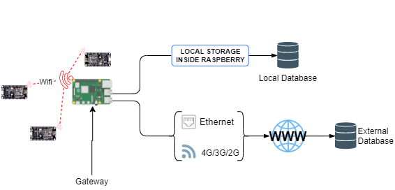
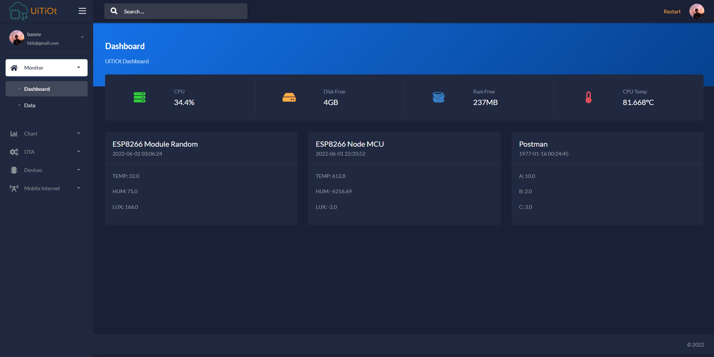

<div id="top"></div>


<!-- PROJECT LOGO -->
<br />
<div align="center">

  <h3 align="center">IOT Gateway</h3>

  <p align="center">
    Gateway for the UiTiOt project.
    <br />
    <a href="#"><strong>Explore the docs »</strong></a>
    <br />
    <br />
    <a href="/tree/master/screenshots">View Demo</a>
    ·
    <a href="#">Report Bug</a>
    ·
    <a href="#">Request Feature</a>
  </p>
</div>


<!-- TABLE OF CONTENTS -->
<details>
  <summary>Table of Contents</summary>
  <ol>
    <li>
      <a href="#about-the-project">About The Project</a>
      <ul>
        <li><a href="#built-with">Built With</a></li>
      </ul>
    </li>
    <li>
      <a href="#getting-started">Getting Started</a>
      <ul>
        <li><a href="#prerequisites">Prerequisites</a></li>
        <li><a href="#installation">Installation</a></li>
      </ul>
    </li>
    <li><a href="#usage">Usage</a></li>
    <li><a href="#roadmap">Roadmap</a></li>
    <li><a href="#contributing">Contributing</a></li>
    <li><a href="#license">License</a></li>
    <li><a href="#contact">Contact</a></li>
  </ol>
</details>


<!-- ABOUT THE PROJECT -->
## About The Project
<div align="center">
   
   
   <a href="SCREENSHOTS.md">View All Screenshots</a>
</div>
<p align="right">(<a href="#top">back to top</a>)</p>


### Built With

* [Flask](https://flask.palletsprojects.com/)
* [Bootstrap](https://getbootstrap.com)
* [JQuery](https://jquery.com)
* [MySql](https://www.mysql.com/)

<p align="right">(<a href="#top">back to top</a>)</p>


<!-- GETTING STARTED -->
## Getting Started


### Prerequisites

* python 3.6+
* pip

### Installation

1. Clone the repo
   ```sh
   https://github.com/nvbao45/IOT-Gateway.git
   ```

2. Install packages
   ```sh
   pip install -r requirements-mysql.txt
   ```
   
3. Install Dependencies  
    ```sh
    sudo apt-get install avahi-utils
    sudo apt-get install ntp
    ```

4. Install arduino-cli
    ```sh
    curl -fsSL https://raw.githubusercontent.com/arduino/arduino-cli/master/install.sh | sh
    ```
    ```sh
    echo 'export PATH="$HOME/bin:$PATH"' >> ~/.bashrc
    ```
    ```sh
    source ~/.bashrc
    ```
    ```sh
    arduino-cli version
    ```

    Create a config file
    ```sh
    mkdir ~/.cli-config.yml
    ```
    Add the following lines to the file
    ```yaml
    board_manager:
      additional_urls:
        - https://arduino.esp8266.com/stable/package_esp8266com_index.json
        - https://raw.githubusercontent.com/espressif/arduino-esp32/gh-pages/package_esp32_index.json
    ```

    Install the board
    ```sh
    arduino-cli core install arduino:avr
    arduino-cli core install esp8266:esp8266 --config-file ~/.cli-config.yml
    arduino-cli core install esp32:esp32 --config-file ~/.cli-config.yml
    ```

5. Config NTP Server
   ```sh
   sudo nano /etc/ntp.conf
   ```
   Add the following lines to the end of the file:
   ```
   server 0.pool.ntp.org iburst
   server 1.pool.ntp.org iburst
   server 2.pool.ntp.org iburst
   server 3.pool.ntp.org iburst
   ```
   Save and exit the file.  

6. Run flask app
   ```sh
   chmod +x run.sh
   ./run.sh
   ```

<p align="right">(<a href="#top">back to top</a>)</p>
