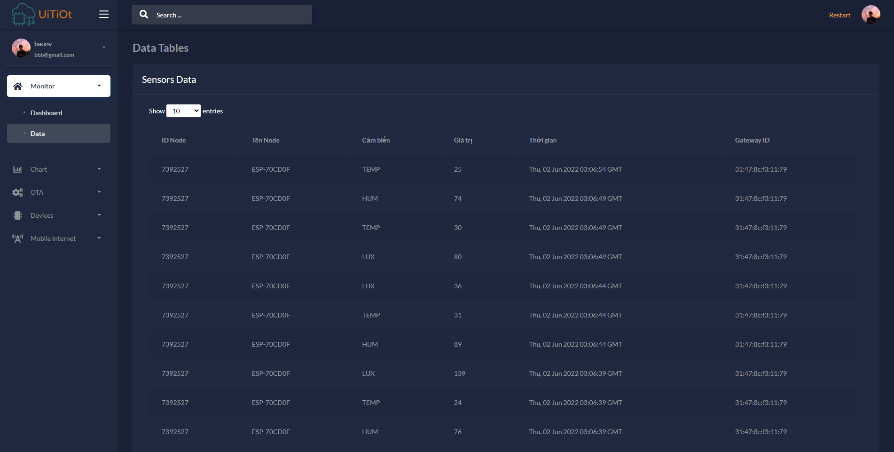
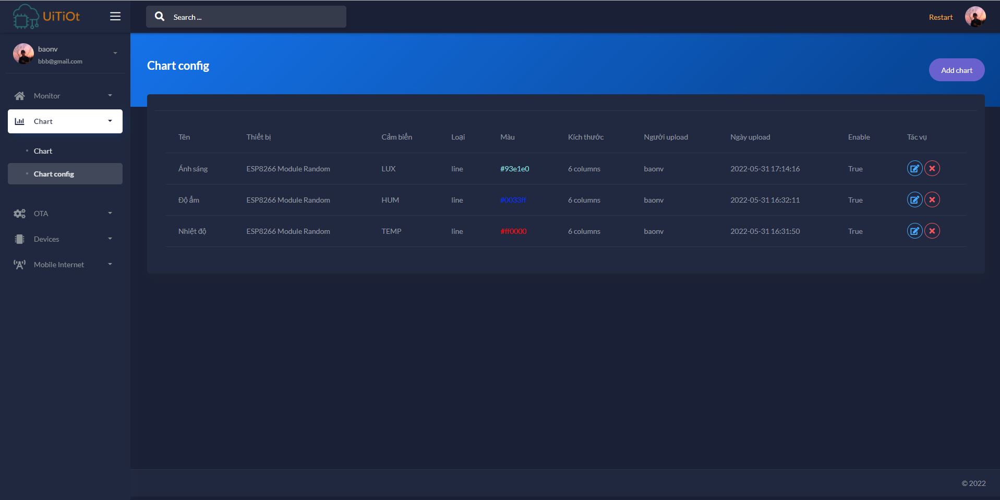
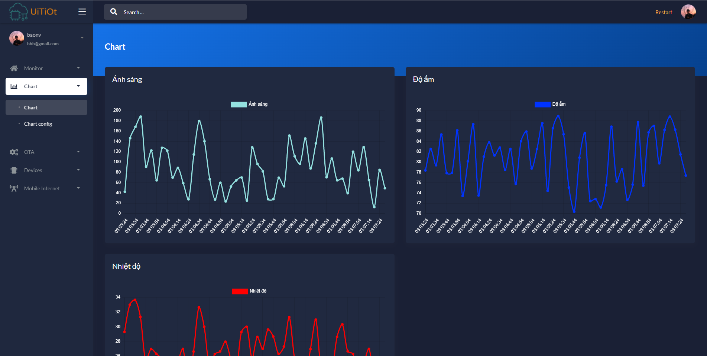
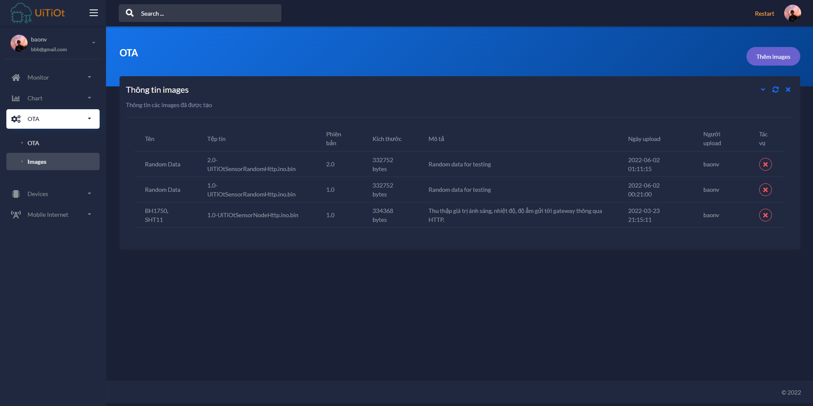
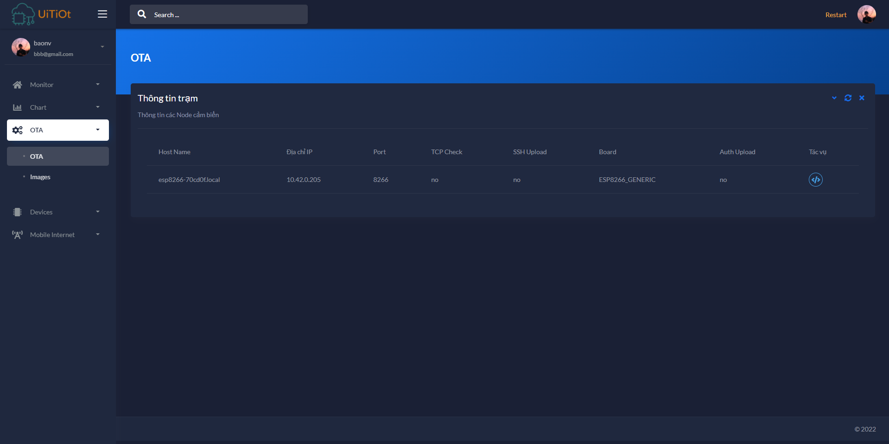
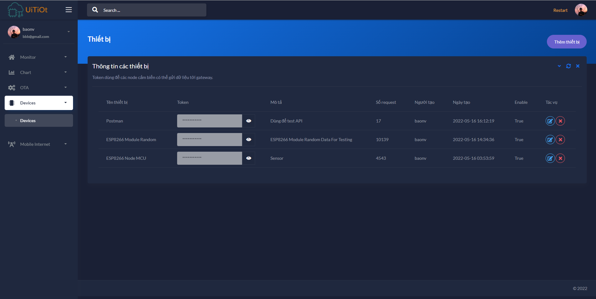
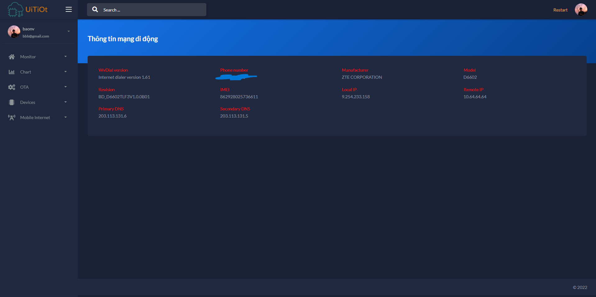

    
    <h3>Thông tin trạm, dữ liệu mới nhất từ các thiết bị thu thập</h3>
    
    <h3>Dữ liệu cảm biến được lưu trữ</h3>
    
    <h3>Cấu hình các biểu đồ để hiển thị</h3>
    
    <h3>Các biểu đồ đã cấu hình</h3>
    
    <h3>Quản lý các firmware để nạp lại cho thiết bị thu thập</h3>
    
    <h3>Thông tin các thiết bị hổ trợ nạp lại firmware từ xa. Có thể nạp lại firmware cho các thiết bị này</h3>
    
    <h3>Quản lý các thiết bị thu thập</h3>
    
    <h3>Thông tin sim được gắng trên gateway</h3>
    

